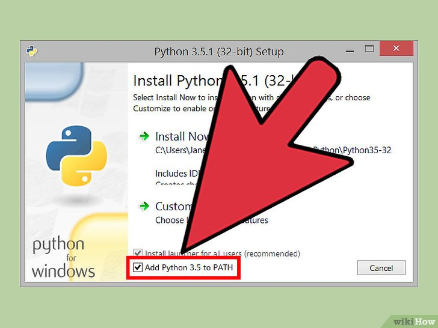
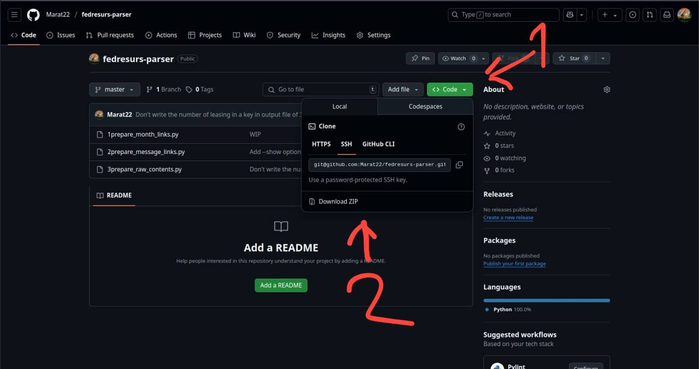

# Инструкция по использованию

После установки программы выполните 4 простых шага. Каждый шаг запускается отдельным файлом в папке **SCRIPTS**. Просто открывайте их по порядку и следуйте инструкциям на экране.

## 📋 Что важно знать перед началом
1. **Результаты каждого шага:**
   - 1-й шаг → файл `1month_links.json`
   - 2-й шаг → файл `2month_links.json`
   - 3-й шаг → папка `3raw_contents` (с сырыми данными)
   - 4-й шаг → итоговый файл **`output.xlsx`**

2. **Время выполнения:**
   - Шаги 1 и 4: быстро (секунды)
   - Шаги 2 и 3: долго (часы, возможно даже дни для больших компаний)
   - Во время 2-го шага компьютером будет сложно пользоваться

3. **Если прервали процесс:**
   - Программа запомнит, где остановилась
   - Просто запустите тот же файл снова и выберите "Продолжить"

4. **Папка BACKUPS:**
   - Во время работы программа автоматически создает резервные копии в папке **BACKUPS**
   - Эту папку не рекомендуется удалять, так как она содержит промежуточные данные, которые могут понадобиться даже через несколько месяцев
   - Если папка занимает слишком много места:
     - Сделайте архив (ZIP/RAR) старых бекапов
     - Перенесите архив на внешний носитель
     - Удалять оригинальные файлы можно только после создания архива

## 🚀 Как работать с программой

### Шаг 1: Подготовка периодов поиска
1. Откройте папку **SCRIPTS**
2. Запустите **`1_STEP_create_month_links.bat`**
3. Введите:
   - Название компании (точно как в Федресурсе)
   - Начальный месяц (можно оставить по умолчанию)
   - Конечный месяц (автоматически подставится текущий)

> 💡 Результат: Создастся список периодов для поиска

### Шаг 2: Поиск ссылок на сообщения
1. Запустите **`2_STEP_create_messages_links.bat`**
2. На вопрос "Пересоздать файл?":
   - Выберите **Да (y)** если меняли компанию или период
   - Выберите **Нет (Enter)** чтобы продолжить с прошлого раза

> ⏳ Самый медленный этап! Лучше запускать на ночь  
> 🔄 Автоматические бекапы сохраняются в BACKUPS/2_STEP_backups/

### Шаг 3: Сбор данных сообщений
1. Запустите **`3_STEP_parse_messages.bat`**
2. Выберите режим:
   - **Видимый браузер (1)** - Рекомендуется! Надёжнее работает
   - Скрытный режим (2) - Только если совсем не можете смотреть за процессом
3. На вопрос о пересоздании папки:
   - **Нет (1)** - Продолжить сбор (лучший выбор)
   - **Да (2)** - Начать всё заново (только если были проблемы)

> ⚠️ Не выключайте компьютер! Процесс может идти много часов  
> 💾 Резервные копии сырых данных сохраняются в BACKUPS/3_STEP_backups/ каждые 100 сообщений

### Шаг 4: Создание Excel-файла
1. Запустите **`4_STEP_create_excel_file.bat`**
2. Дождитесь сообщения "Файл output.xlsx успешно создан!"
3. На вопрос "Открыть файл?" нажмите:
   - **Y** - чтобы сразу посмотреть результат
   - **N** - если откроете позже

> ✅ Готово! Результат сохранён в главной папке программы  

# Инструкция по установке зависимостей:
1. [Скачать](https://www.google.com/chrome/) и установить Chrome
2. [Скачать **chromedriver**](https://googlechromelabs.github.io/chrome-for-testing/) нужной версии под нужную ОС (**не chrome, именно chromedriver**)
   1. После того, как скачали, нужно распаковать архив
   2. В распакованном архиве найдите файл chromedriver и скопируйте путь к папке, в которой он лежит
   3. Добавьте папку в PATH:
      1. На Windows вам нужно открыть командную строку и ввести:
          ```
          setx PATH="%PATH%;C:/ПУТЬ/К/ПАПКЕ/С/chromedriver"
          ```
      2. После добавления папки в PATH можете закрыть командную строку
   4. Можете теперь удалить архив
3. [Скачать python 3.12](https://www.python.org/downloads/release/python-3120/) под нужную ОС. Можете просто перейти по [этой](https://www.python.org/ftp/python/3.12.0/python-3.12.0-amd64.exe) ссылке, чтобы скачать на windows.
4. Запустить установщик и **ВАЖНО** нажать на кнопку "Add Python 3.12 to PATH". Она должна располагаться примерно здесь:



# Инструкция по установке программы
1. Теперь установите саму программу. Для этого на текущей странице нажмите `Code`, а затем `Download ZIP`:

   1. Распакуйте файлы
   2. Можете удалить архив
2. Перейдите в распакованную папку с программой:
   - Нажмите правой кнопкой мыши по пустому месту в папке, удерживая Shift, и выберите "Открыть в Терминале" (Windows) или "Открыть в командной строке"
   - Или откройте командную строку/терминал и перейдите в папку с помощью команды `cd`, например:
     ```
     cd C:\Users\ВашеИмя\Downloads\название_папки_программы
     ```

3. Установите необходимые Python-зависимости, выполнив в командной строке:
   ```
   pip install -r requirements.txt
   ```

4. После успешной установки зависимостей вы можете запустить программу:
   ```
   python main.py
   ```
   или
   ```
   python3 main.py
   ```

5. Создать виртуальное окружение:
   ```
   python -m venv venv
   ```
   - Активируйте его:
     - На Windows: `venv\Scripts\activate`
     - На macOS/Linux: `source venv/bin/activate`
   - И затем установите зависимости внутри виртуального окружения.

# todo
- [x] надо писать верхний заголовок из страницы сообщения (опционально)
- [x] у лизингодателей разделить ИНН и ОГРН (в excel файле)
- [x] сделать сбор данных по Лизингодателям!
- [x] по дефолту парсить только данные после: 28 апреля 2023 года